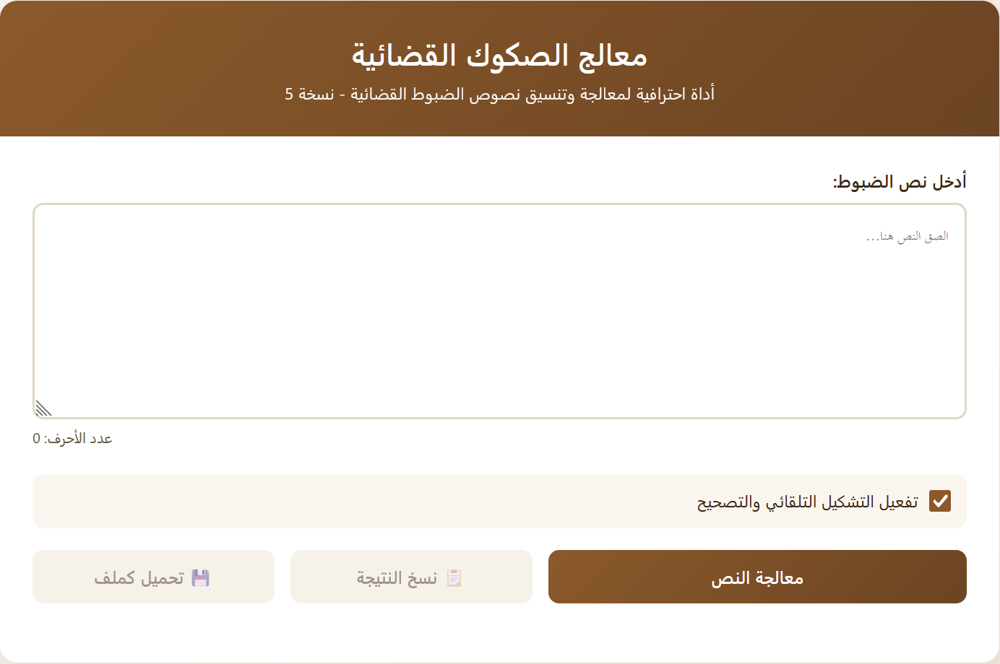

<div align="center">

# ⚖️ معالج الصكوك القضائية

### أداة احترافية لمعالجة وتنسيق نصوص الضبوط القضائية

[](https://abosalehg-ui.github.io/sakk-processor/)
[](https://developer.mozilla.org/en-US/docs/Web/HTML)
[](https://developer.mozilla.org/en-US/docs/Web/CSS)
[](https://developer.mozilla.org/en-US/docs/Web/JavaScript)

</div>

---

## 📋 نبذة عن المشروع

**معالج الصكوك القضائية** هو تطبيق ويب متكامل مصمم خصيصاً لمساعدة العاملين في المجال القضائي على معالجة وتنسيق نصوص الضبوط والصكوك القضائية بشكل آلي وسريع. يقوم التطبيق بتنظيف النصوص وتصحيحها لغوياً ودمج الجلسات المتكررة وحذف جلسات الشطب غير الضرورية.

---

## 🖼️ لقطة شاشة

<div align="center">



</div>

---

## ✨ المميزات

| الميزة | الوصف |
|--------|-------|
| 🔄 **دمج الجلسات** | دمج الجلسات المتكررة تلقائياً وتحويلها إلى صيغة "وفي جلسة أخرى" |
| 🗑️ **حذف جلسات الشطب** | اكتشاف وحذف جلسات الشطب تلقائياً من النص |
| ✏️ **التصحيح اللغوي** | تصحيح الأخطاء الإملائية الشائعة وإضافة التشكيل للكلمات |
| 🔧 **تنسيق المسافات** | استبدال المسافات المزدوجة بمسافة واحدة |
| 📝 **تصحيح علامات الترقيم** | تصحيح موضع النقطتين الرأسيتين |
| 📊 **إحصائيات تفصيلية** | عرض إحصائيات شاملة لجميع التعديلات المُجراة |
| 👀 **مقارنة النصوص** | عرض النص الأصلي والمعدّل جنباً إلى جنب |
| 🎨 **تمييز التصحيحات** | تمييز الكلمات المصححة بخط أحمر للمراجعة |
| 📋 **نسخ سريع** | نسخ النتيجة إلى الحافظة بضغطة زر |
| 💾 **تحميل الملف** | تحميل النص المعالج كملف نصي |
| 📱 **تصميم متجاوب** | يعمل على جميع الأجهزة (حاسوب، جوال، تابلت) |

---

## 🚀 طريقة الاستخدام

### التجربة المباشرة
يمكنك تجربة التطبيق مباشرة من خلال الرابط:

🔗 **[تجربة التطبيق](https://abosalehg-ui.github.io/sakk-processor/)**

### الاستخدام المحلي
1. قم بتحميل الملف `index.html`
2. افتح الملف في أي متصفح ويب
3. الصق نص الضبط في مربع الإدخال
4. اضغط على زر **"معالجة النص"**
5. راجع النتائج وانسخها أو حملها كملف

---

## 🛠️ التقنيات المستخدمة

- **HTML5** - هيكل الصفحة
- **CSS3** - التصميم والتنسيق مع تدرجات لونية احترافية
- **JavaScript** - المنطق البرمجي ومعالجة النصوص باستخدام التعبيرات النمطية (Regex)

---

## 📊 العمليات التي يقوم بها التطبيق

```
1️⃣ استبدال المسافات المزدوجة بمسافة واحدة
2️⃣ تصحيح موضع النقطتين الرأسيتين (" :" → ": ")
3️⃣ حذف الأسطر الفارغة الزائدة
4️⃣ دمج الجلسات المتكررة (5 أنماط مختلفة)
5️⃣ التصحيح اللغوي والإملائي (قاموس يحتوي على مئات الكلمات)
6️⃣ حذف جلسات الشطب تلقائياً
```

---

## 📈 خطط التطوير المستقبلية

- [ ] تحسين خوارزمية اكتشاف جلسات الشطب
- [ ] تطوير آلية دمج الجلسات لتشمل أنماط أكثر
- [ ] إضافة المزيد من قواميس التصحيحات التلقائية
- [ ] دعم تصدير الملفات بصيغ متعددة (PDF, DOCX)

---

## 👨‍💻 المؤلف

<div align="center">

**عبدالكريم العبود**

[](mailto:abo.saleh.g@gmail.com)
[](https://github.com/abosalehg-ui)

</div>

---

## 🙏 شكر وتقدير

شكر خاص للزميل **عمر بن أحمد العمري** على مساهمته ودعمه في هذا المشروع.

---

<div align="center">

**صُنع بـ ❤️ لخدمة العاملين في القطاع القضائي**

</div>
